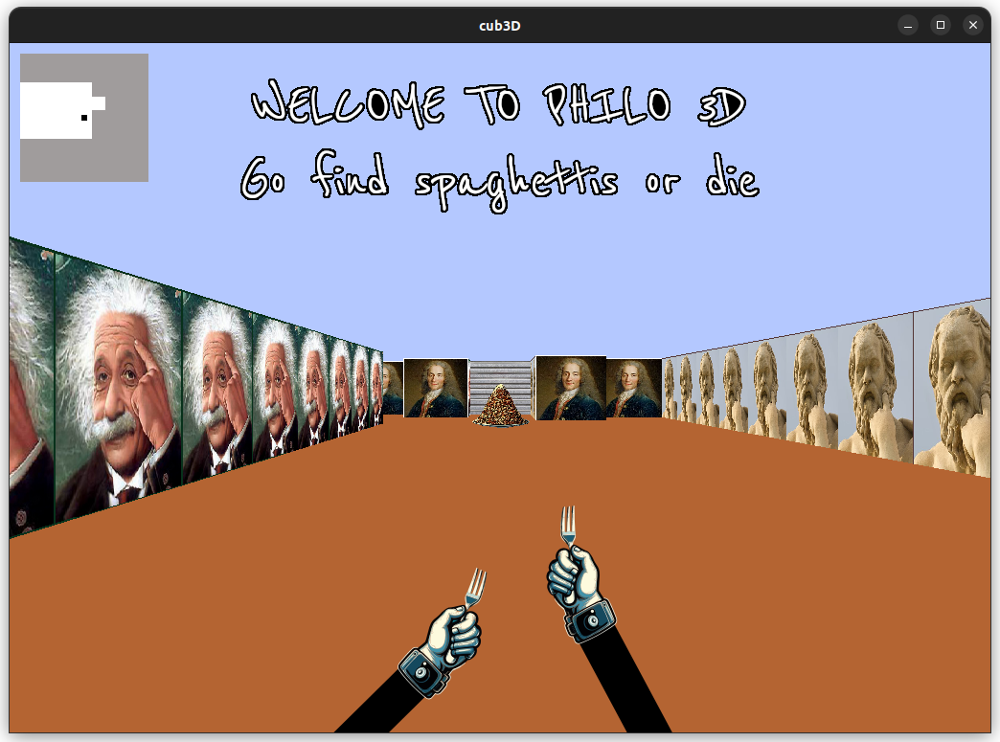

# Cub3d (school 42 project)

## Project overview
This project is a C-based implementation of a raycasting engine designed to create a simple 3D game reminiscent of Wolfenstein 3D. It was a two-person group project.

## Contents

- [Description](#description)
- [Installation](#installation)
- [Usage](#usage)
- [Contributors](#contributors)
- [Acknowledgments](#acknowledgments)
- [License](#license)



## Description
The primary objective is to develop a basic first-person game where the player navigates through a maze-like environment. The raycasting technique is used to simulate 3D perspectives within a 2D grid, rendering walls, floors, and objects based on the player's viewpoint. The project involves key concepts such as player movement, sprites, collision detection, and minimalistic graphics rendering to achieve a retro gaming experience.

## Installation

1. **Clone the git :**
   ```bash
   git clone https://github.com/Kernicterus/Cub3d_42.git
   ```

2. **Clone the git of the minilibx at the root of the repo:**
   ```bash
   cd Cub3d_42 && git clone https://github.com/42Paris/minilibx-linux.git
   ```

3. **Make :**
   ```bash
   make bonus
   ```

## Usage

4. **Run the program :**
   ```bash
   ./cub3D <map.cub>
   ```

5. **Commands :**
- q, s, d, z to move
- 'e' to open gates

## Contributors
[ArmandI0](https://github.com/ArmandI0)

## Aknowledgments
- **42 school**: I wish to express my sincere appreciation to 42 school for imparting essential knowledge and skills in coding. 

## License
This project is licensed under the MIT License. See the [LICENSE file](LICENSE.md) for more details.

